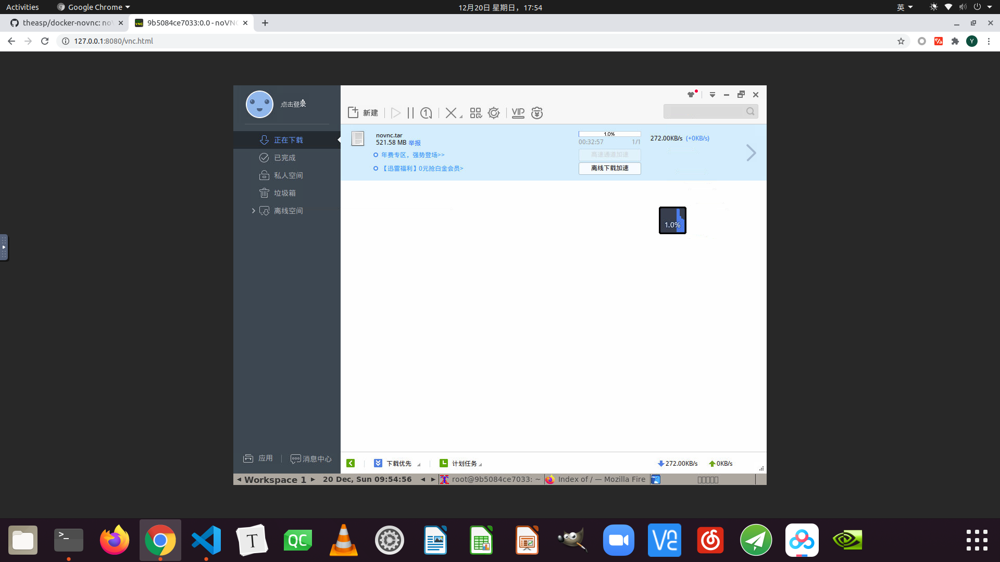

# xunlei-novnc-docker

基于deepin-wine和ubuntu和novnc的迅雷docker

在ubuntu和其他linux机器特别是没有图形界面的server上要安装使用deepin-wine软件比较麻烦，直接装deepinwine比较容易乱(因为用32位软件)，在远程环境使用ssh x11又比较卡；而使用vnc和novnc比较好

### build
```bash
docker build docker -t xunlei-novnc
```

### run

根据需要挂载本地目录到迅雷下载，映射22端口

```bash
docker run \
  --rm \
  -p 8080:8080 \
  xunlei-novnc
```

### 启动迅雷

在vnc的终端里启动，第一次会出错退出，第二次就行了
```bash
/opt/deepinwine/apps/Deepin-ThunderSpeed/run.sh
```

也可以安装使用其他deepin-wine软件，没测试过



### 感谢


theasp的novnc-docker：https://github.com/theasp/docker-novnc

wszqkzqk的deepin-wine-ubuntu：https://github.com/wszqkzqk/deepin-wine-ubuntu

wszqkzqk的deepin-wine-containers-for-ubuntu：https://github.com/wszqkzqk/deepin-wine-containers-for-ubuntu

递归感谢上面项目中感谢的